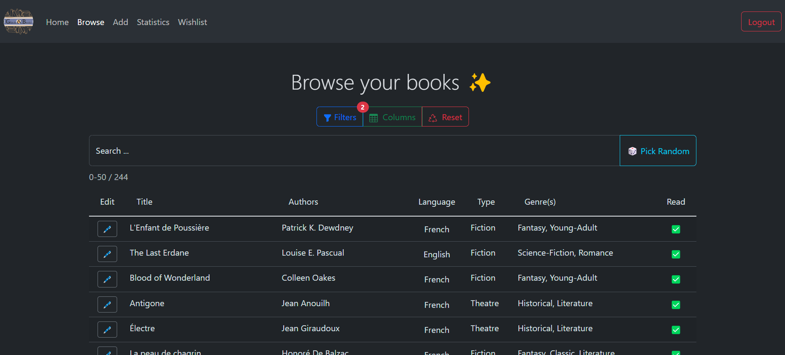
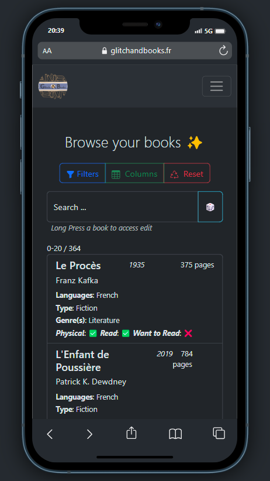
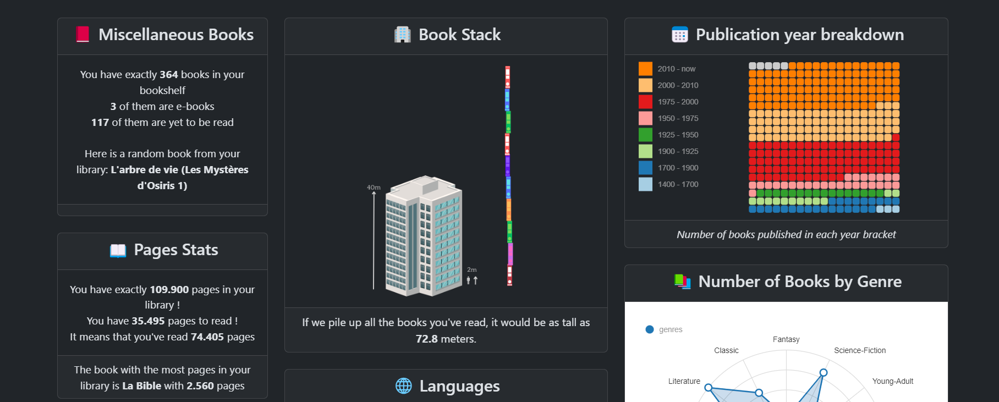
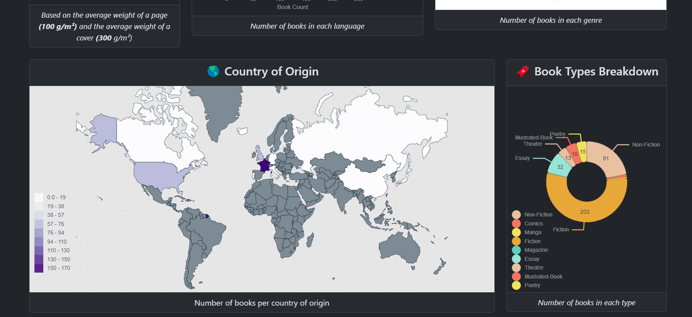

# Glitch & Books

## Your own free online library !

## Table of Contents

- [What is Glitch & Books ?](#what-is-glitch--books-)

- [Want to try it ?](#want-to-try-it-)

- [Primary Features](#primary-features)

- [Secondary Features](#secondary-features)

- [Technologies](#technologies)

- [The technologies / Me](#the-technologies--me)

## What is Glitch & Books ?

Glitch & Books is a free online library, where you store your books data and consult them from anywhere !

The first goal of this project is to be able to sort, filter and search your books, have a quick overview of your library !

> You want to lend a book to a friend, but can't remember if you still have it ? No problem, just check your library !

## Want to try it ?

The project is still in development, but you can try it here : https://glitchandbooks.fr !
And here a limited demo account :

| Username | Password           |
| -------- | ------------------ |
| `Test`   | `testGlitch&Books` |

## Primary Features

> All the features are not implemented yet, but here is the list of the primary features I want to implement.

- Add books to your library ✅
- Consult your library ✅
- Fully Dynamic Interface to consult your books, one for computer screen, one for mobile screen ✅
- Edit your books ✅
- Delete your books ✅
- Sort your books by title, author, date, genre, ... ✅
- Filter your books by title, author, date, genre, ... ✅
- Secure on an HTTPS server ✅

## Secondary Features

> These features are not the main goal of the project, but I want to implement them.

- Proper Account system 🕒
  (Currently it's a basic User - Id - Password system)
- Add books to your wishlist 🕒
- Consult your wishlist 🕒
- Having a stats page with graphs / funny comparisons (ex: "You have read 3 times more books than the average user !" "If we put all the your books on a shelf, it would be 3 times higher than the Eiffel Tower !") ✅
- Having a "random book" button ✅
- Having a carrousel with suggestion like "You may also like" / "random book" 🕒
- Having a "Here some book to read" section 🕒
- Being able to export your library as a PDF / Excel / Json file 🕒
- Being able to share your library with your friends 🕒
- Having a full log system (Saved on database) 🕒

## Technologies

| Name     | Description       | Precisions   | Version |
| -------- | ----------------- | ------------ | ------- |
| Node     |                   |              | 20.5.0  |
| React    | Front-end library | TypeScript   | 18.2.0  |
| Express  | Back-end          | TypeScript   | 4.17.17 |
| Postgres | Database [ORM]    | With TypeOrm | 8.0.0   |

## The technologies / Me

I've never been able to make a proper website out of school so after doing way too many years doing only Discord bots, I decided to give it a try, and learn for good the FullStack development. It's a first for React, but already used Angular before, and I'm used to TypeScript. This project has been and is still a huge source of new knowledge for me, going from a basic DNS configuration, using Docker to deploy my app, finally touch to React, and so much more !
For my own pride, I'm gonna list here all the things I've learned during this project :

| Name                           |
| ------------------------------ |
| ExpressTS                      |
| React                          |
| Docker                         |
| DNS / Web Domain configuration |
| Back Authenticated routes      |
| GitHub Deploy                  |
| React Router                   |
| Nginx / HTTPS Certificat       |
